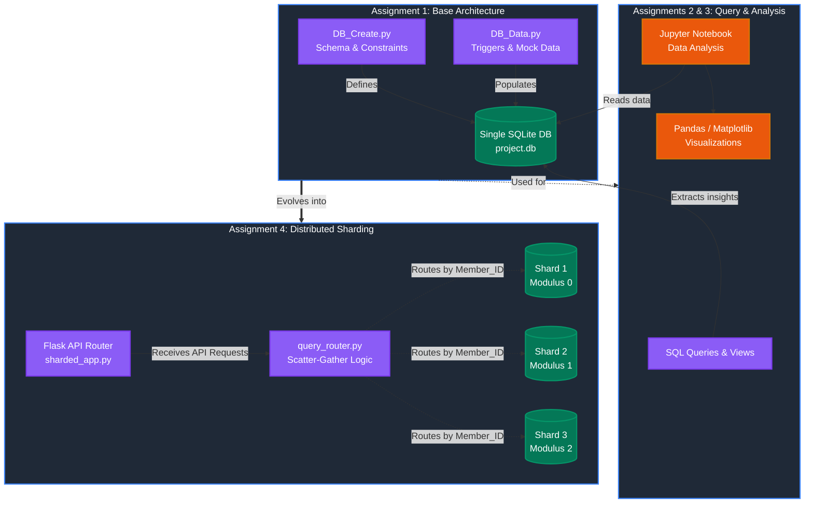

# Sharkey Database Project (Team 38)

Welcome to the **Sharkey Database Project**, a comprehensive sports and club management database system developed as part of an academic course project (CS432). This project demonstrates the full lifecycle of database design, implementation, analysis, and distributed systems.

## Project Architecture & Flow



## Project Overview

The project is structured into four main phases (assignments), gradually building from a single-node SQLite database to a distributed, sharded backend with a Flask API.

### 1. Schema Design and Triggers (`Assignment_1`)
- **Objective:** Design the foundational relational schema.
- **Technologies:** SQLite, Python.
- **Features:** 
  - Implementation of tables for `Member`, `Facility`, `Booking`, `Complaint`, `Attendance`, and `Player_Stat`.
  - Enforcing data integrity using SQLite `CHECK` constraints, foreign keys, and custom `TRIGGER`s (e.g., preventing booking overlaps and equipment loan limit violations).
  - Python scripts (`DB_Create.py`, `DB_Data.py`, `DB_Check.py`) for automated database initialization and testing.

### 2. SQL Queries and Views (`Assignment_2`)
- **Objective:** Complex data retrieval and reporting.
- **Technologies:** SQL.
- **Features:**
  - Nested queries, joins, and aggregations to extract meaningful insights from the club's data.
  - Creation of SQL `VIEW`s to abstract complex reporting logic for administrators and coaches.

### 3. Data Analysis and Visualization (`Assignment_3`)
- **Objective:** Analyze database metrics using data science tools.
- **Technologies:** Python, Jupyter Notebooks, Pandas, Matplotlib/Seaborn.
- **Features:**
  - Exporting data from the relational database into DataFrames.
  - Generating analytical reports (`CS432_Assignment3_Report.ipynb` & `.pdf`) covering member demographics, facility utilization rates, and attendance trends.

### 4. Distributed Sharding and API (`Assignment_4`)
- **Objective:** Scale the database using a custom sharding architecture.
- **Technologies:** MySQL (Distributed Shards), Python, Flask.
- **Features:**
  - Partitioning the `Member`, `Booking`, `Complaint`, `Attendance`, and `Player_Stat` tables across three MySQL instances using a hash-based routing strategy on `Member_ID`.
  - Replicating the `Facility` table across all shards for fast local joins.
  - A Flask REST API (`sharded_app.py`) acting as a smart query router that implements point lookups (routed to a single shard) and scatter-gather range queries (broadcasting to all shards and aggregating results).
  - Automated migration and initialization scripts (`init_shards.py`, `migrate_data.py`).

## Getting Started

To explore or run the distributed backend (Assignment 4):

1. **Install Dependencies:**
   Ensure you have Python 3.12+ installed, then run:
   ```bash
   python -m pip install -r Assignment_4/requirements.txt
   ```

2. **Initialize Shards & Migrate Data:**
   *(Note: This requires access to the configured MySQL instances, or you can point the environment variables to local databases)*
   ```bash
   python Assignment_4/router/init_shards.py
   python Assignment_4/router/migrate_data.py
   ```

3. **Run the Flask Router:**
   ```bash
   python Assignment_4/sharded_app.py
   ```
   The API will be available at `http://localhost:5001`.

4. **Verify Sharding Integrity:**
   ```bash
   python Assignment_4/tests/verify_sharding.py
   ```

## Contributors (Team 38)

This project was developed by:
* **Moram Koushik** (Roll No: 24220210)
* **Busa Bhava Ram** (Roll No: 24110083)
* **Dudekula Mukkesh** (Roll No: 24110114)
* **Ambati Chaitanya Ram** (Roll No: 24110035)
* **Cherukuri Harshith Sai** (Roll No: 24110091)


